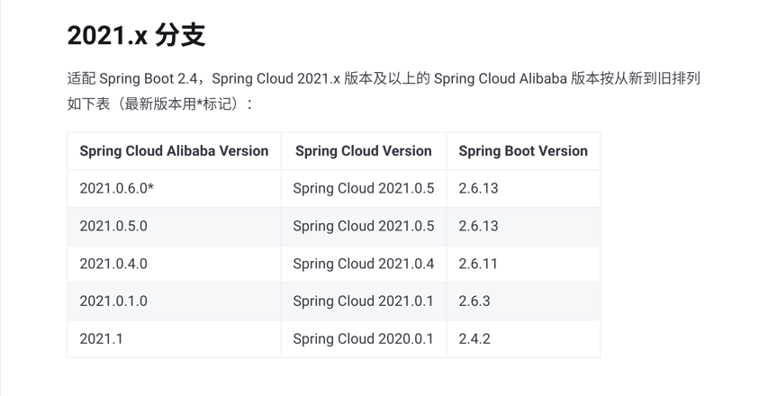
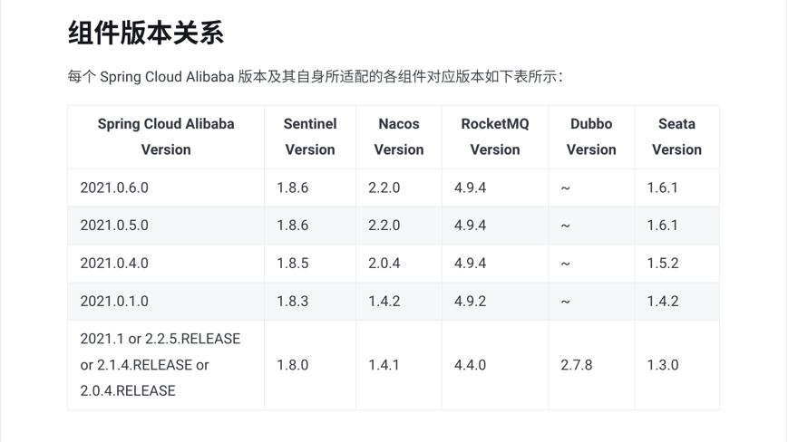
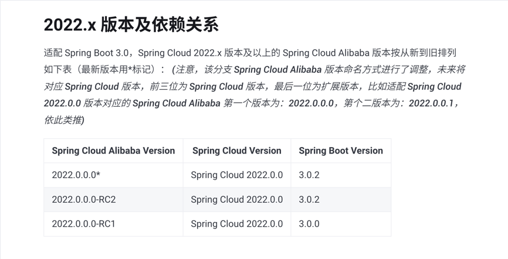
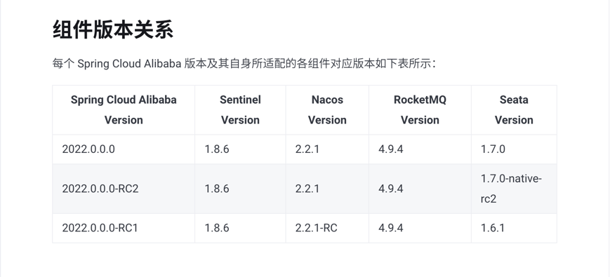
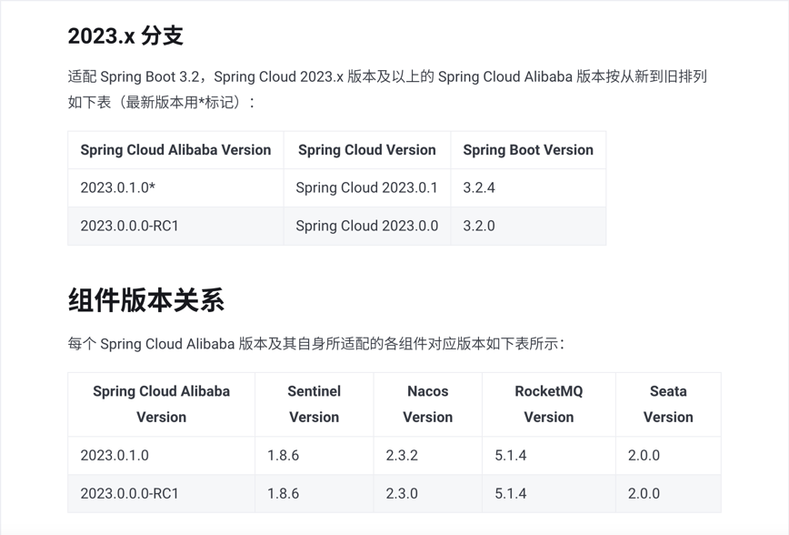

### 版本关系

以下为官方截图，具体信息请参考官方文档：[https://sca.aliyun.com/](https://sca.aliyun.com/)

<VersionTabs :tabs="[
{ label: '2021.0.x', slot: 'v2021' },
{ label: '2022.0.x', slot: 'v2022' },
{ label: '2023.0.x', slot: 'v2023' }
]">
<template #v2021>

</template>

<template #v2022>

</template>

<template #v2023>

</template>
</VersionTabs>

---

### 项目 Demo

Demo 地址：https://github.com/mzyaoo/spring-cloud-example

**Demo 版本说明**

- JDK版本：1.8
- Spring Boot 2.7.18
- Spring Cloud 2021.0.5
- Spring Cloud Alibaba 2021.0.6.2
- 分布式事务：seata
- 注册配置中心：naces
- 网关：gateway
- 服务熔断降级：sentinel
- 服务调用：openfeign
- Mysql：8.x

**Demo 对应版本服务包下载**

[Seata-1.6.1下载](https://github.com/apache/incubator-seata/releases/tag/v1.6.1)  
[Nacos-2.2.0下载](https://github.com/alibaba/nacos/releases/tag/2.2.0)  
[Sentinel-1.8.6下载](https://github.com/alibaba/Sentinel/releases/tag/1.8.6)  

> 完成情况

完成 nacos、sentinel、openfeign、gateway、knife4j接口文档的整合、分布式事务 seata 初步完成

> 问题总结（已解决）

**连接远程服务器中的 Nacos 错误**

配置安全组访问规则端口：8848、9848

> [!Warning]
> 对于暴露的端口描述，也可查看官方解释：https://nacos.io/en/blog/faq/nacos-user-question-history15220/

> 待解决问题

**OpenFeign相应问题**

api-02 业务请求 api-01业务接口，由于 api-01 接入鉴别网关请求拦截，非网关转发请求则有请求过滤器拦截返回非法请求 JSONResult
字符串，导致 OpenFeign 返回错误,
初步方法，增加网关请求转发请求头，避开此报错。
