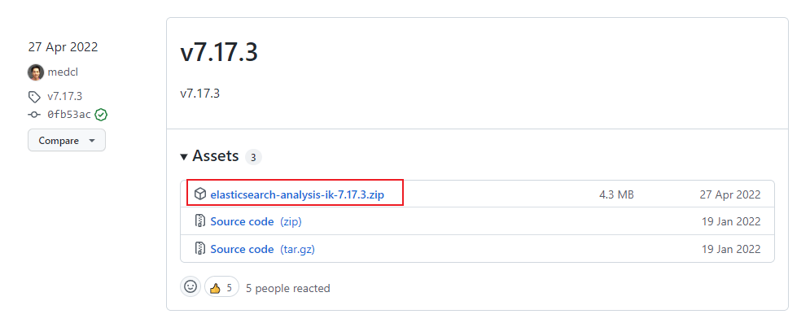
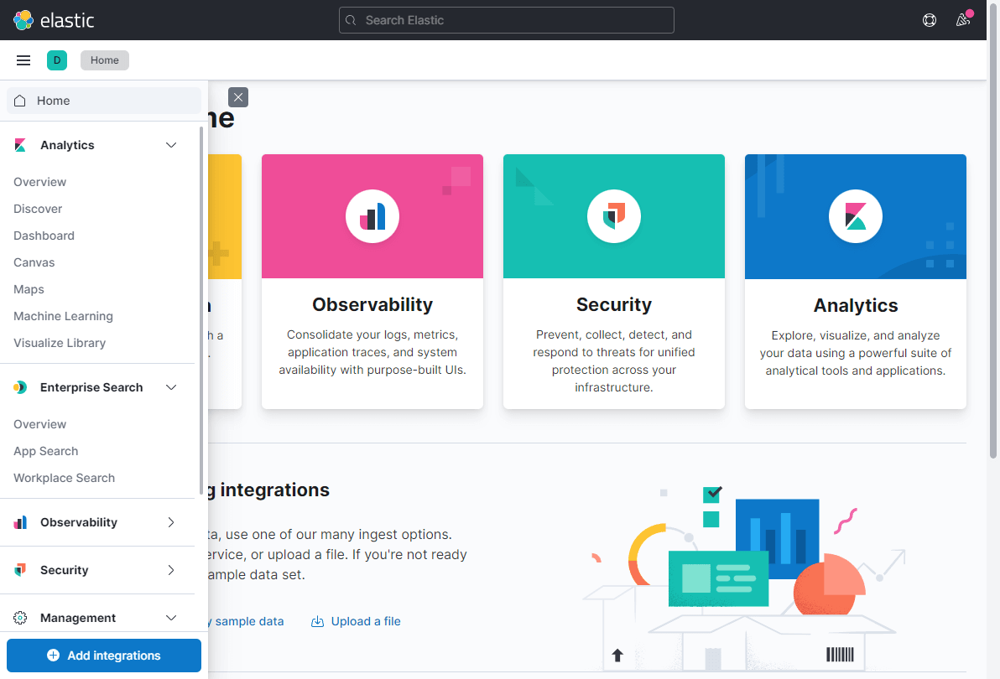
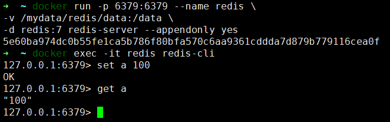

# Docker服务安装
### MongoDB安装
**下载MongoDB的Docker镜像**
```shell
docker pull mongo:4.2.5
```
**使用Docker命令启动MongoDB服务**
```shell
docker run -p 27017:27017 --name mongo \
-v /mydata/mongo/db:/data/db \
-d mongo:4.2.5
```
**进入容器中的MongoDB客户端**
```shell
docker exec -it mongo mongo
```
**在`admin`集合中创建一个账号用于连接，这里创建的是基于`root`角色的超级管理员帐号**
```shell
use admin

db.createUser({ 
    user: 'mongoAdmin', 
    pwd: 'secret', 
    roles: [ { role: "root", db: "admin" } ] 
});
```

## MySQL安装

**下载MySQL5.7的docker镜像：**

```bash
docker pull mysql:5.7
```

**使用如下命令启动MySQL服务：**

```bash
docker run -p 3306:3306 --name mysql \
-v /mydata/mysql/log:/var/log/mysql \
-v /mydata/mysql/data:/var/lib/mysql \
-v /mydata/mysql/conf:/etc/mysql \
-e MYSQL_ROOT_PASSWORD=84wl5rce  \
-d mysql:5.7
```

参数说明
- `-p 3306:3306`：将容器的3306端口映射到主机的3306端口
- `-v /mydata/mysql/conf:/etc/mysql`：将配置文件夹挂在到主机
- `-v /mydata/mysql/log:/var/log/mysql`：将日志文件夹挂载到主机
- `-v /mydata/mysql/data:/var/lib/mysql`：将数据文件夹挂载到主机
- `-e MYSQL_ROOT_PASSWORD=root`：初始化root用户的密码

**进入运行MySQL的docker容器：**

```bash
docker exec -it mysql /bin/bash
```

**使用MySQL命令打开客户端：**

```bash
mysql -uroot -proot --default-character-set=utf8
```

## Elasticsearch安装

**下载Elasticsearch7.17.3的docker镜像：**

```bash
docker pull elasticsearch:7.17.3
```

**修改虚拟内存区域大小，否则会因为过小而无法启动:**

```bash
sysctl -w vm.max_map_count=262144
```

**使用如下命令启动Elasticsearch服务，内存小的服务器可以通过ES_JAVA_OPTS来设置占用内存大小：**

```bash
docker run -p 9200:9200 -p 9300:9300 --name elasticsearch \
-e "discovery.type=single-node" \
-e "cluster.name=elasticsearch" \
-e "ES_JAVA_OPTS=-Xms512m -Xmx1024m" \
-v /mydata/elasticsearch/plugins:/usr/share/elasticsearch/plugins \
-v /mydata/elasticsearch/data:/usr/share/elasticsearch/data \
-d elasticsearch:7.17.3
```

**启动时会发现/usr/share/elasticsearch/data目录没有访问权限，只需要修改/mydata/elasticsearch/data目录的权限，再重新启动即可；**

```bash
chmod 777 /mydata/elasticsearch/data/
```

**安装中文分词器IKAnalyzer，注意下载与Elasticsearch对应的版本[点击下载](https://github.com/medcl/elasticsearch-analysis-ik/releases),下载完成后解压到Elasticsearch的/mydata/elasticsearch/plugins目录下；**



**重新启动服务：**

```bash
docker restart elasticsearch
```

**开启防火墙：**

```bash
firewall-cmd --zone=public --add-port=9200/tcp --permanent
firewall-cmd --reload
```

**访问会返回版本信息：http://192.168.3.101:9200**

```json
{
  "name": "708f1d885c16",
  "cluster_name": "elasticsearch",
  "cluster_uuid": "mza51wT-QvaZ5R0NmE183g",
  "version": {
    "number": "7.17.3",
    "build_flavor": "default",
    "build_type": "docker",
    "build_hash": "5ad023604c8d7416c9eb6c0eadb62b14e766caff",
    "build_date": "2022-04-19T08:11:19.070913226Z",
    "build_snapshot": false,
    "lucene_version": "8.11.1",
    "minimum_wire_compatibility_version": "6.8.0",
    "minimum_index_compatibility_version": "6.0.0-beta1"
  },
  "tagline": "You Know, for Search"
}
```

## Kibana安装

**下载Kibana7.17.3的docker镜像：**

```bash
docker pull kibana:7.17.3
```

**使用如下命令启动Kibana服务：**

```bash
docker run --name kibana -p 5601:5601 \
--link elasticsearch:es \
-e "elasticsearch.hosts=http://es:9200" \
-d kibana:7.17.3
```

**开启防火墙：**

```bash
firewall-cmd --zone=public --add-port=5601/tcp --permanent
firewall-cmd --reload
```

**访问地址进行测试：http://ip:5601**



## RabbitMQ安装

**下载rabbitmq3.9-management的docker镜像：**

```bash
docker pull rabbitmq:3.9-management
```

**使用如下命令启动RabbitMQ服务：**

```bash
docker run -p 5672:5672 -p 15672:15672 --name rabbitmq \
-v /mydata/rabbitmq/data:/var/lib/rabbitmq \
-d rabbitmq:3.9-management
```

**开启防火墙：**

```bash
firewall-cmd --zone=public --add-port=15672/tcp --permanent
firewall-cmd --reload
```

**访问地址查看是否安装成功：http://ip:15672**<br/>
**默认的用户名和密码为：`guest`**


## Redis安装

**下载Redis7的docker镜像：**

```bash
docker pull redis:7
```

下载redis配置文件
- 官网链接：[Redis](https://redis.io/download/)
- 将下载包中的 `redis.conf` 放入 `/mydata/redis/config` 中

**使用如下命令启动Redis服务：**

```shell
docker run -p 6379:6379 --name redis \
-v /mydata/redis/conf/redis.conf:/etc/redis/redis.conf \
-v /mydata/redis/data:/data \
-d redis:7 redis-server /etc/redis/redis.conf --appendonly yes
```

**进入Redis容器使用redis-cli命令进行连接：**

```bash
docker exec -it redis redis-cli
```


