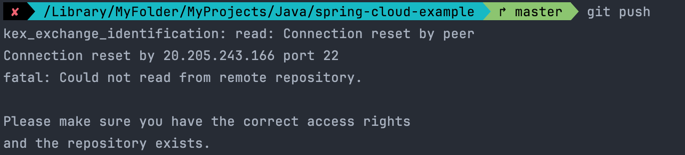

### Git命令

```shell
# 同步远程分支
git fetch --prune

# 撤销到合并前
git reset --hard ORIG_HEAD

# 丢弃所有文件的修改
git restore .
```

### 代理导致的网络问题



以上为错误图例，初步定位为网络代理导致的问题，此问题出现在 Macos 系统上。<br/>
解决方式如下：<br/>
进入用户目录下找到 `.ssh` 目录，创建 `config` 文件，编辑此文件，内容信息如下：
```shell
Host github.com
    Hostname ssh.github.com
    Port 443
    User git
```
通过再次连接到 GitHub.com 来测试其是否有效：
```shell
$ ssh -T -p 443 git@ssh.github.com
# Hi USERNAME! You've successfully authenticated, but GitHub does not
# provide shell access.
```
如果看到以上信息，则说明已经成功连接到 GitHub.com。<br/>
以上内容出处：https://docs.github.com/en/authentication/troubleshooting-ssh/using-ssh-over-the-https-port