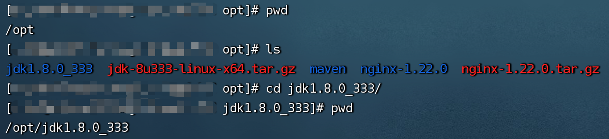

# CentosOS 环境搭建

### JDK
[JDK-1.8 点击下载](https://www.123pan.com/s/hKskjv-0Flbd.html)

**上传并解压至opt目录下**
```shell
tar -zxvf jdk-8u333-linux-x64.tar.gz -C /opt
```
***如图***


**配置java全局环境变量**
```shell
# 1.编辑系统环境配置文件
vim /etc/profile

# 2.将一下内容copy至系统环境配置文件
#java
JAVA_HOME=/opt/jdk1.8.0_333
CLASSPATH=$JAVA_HOME/lib/
PATH=$PATH:$JAVA_HOME/bin
export PATH JAVA_HOME CLASSPATH

# 3.刷新配置文件
source /etc/profile
```
**检查是否安装成功**
```shell
java -version
```
***如图***


### MySql-8.0
**创建并进入mysql文件夹**
```shell
mkdir /opt/mysql

cd /opt/mysql
```
**下载mysql rpm包**
```shell
wget https://dev.mysql.com/get/mysql80-community-release-el7-5.noarch.rpm
```
**安装mysql**
```shell
yum localinstall -y mysql80-community-release-el7-5.noarch.rpm
```
**yum仓库中查找mysql**
```shell
yum search mysql-community
```
**安装 mysql-community-server**
```shell
yum install -y mysql-community-server
```
> [!Warning]
> 可能出现软件包不适用错误，错误图例如下。 <br/>
> 出现错误请使用此命令：`yum install mysql-server --nogpgcheck`


**以上没有报错的情况下，表示mysql安装完成，mysql相关命令**
```shell
# 启动
systemctl start mysqld

# 停止
systemctl stop mysqld

# 检查状态
systemctl status mysqld

# 设置开机启动
systemctl enable mysqld
```

**查看mysql运行日志，获取默认密码**
```shell
vi /var/log/mysqld.log
```
**登录mysql**
```shell
mysql -uroot -p
输入从日志获取到的默认密码
```
**修改密码**
```shell
alter user 'root'@'localhost' identified with mysql_native_password by '66alwWqIat!sas';
```
**查看所有的数据库**
```shell
show databases;
```
**使用mysql库**
```shell
use mysql;
```
**让root用户可以在任意主机登陆**
```shell
update user set host = '%' where user = 'root';
```
**使以上配置生效**
```shell
flush privileges;
```
**打开防火墙,放行对应mysql服务端口,如果是云服务器，可以在控制台配置防火墙规则**
```shell
# 添加放行3306端口
firewall-cmd --zone=public --permanent --add-port=3306/tcp

# 将防火墙配置重载
firewall-cmd --reload
```
**mysql配置完成，接下来就可以使用外部可视化工具进行连接**

### Maven
[maven-3.8.5 点击下载](https://www.123pan.com/s/hKskjv-rFlbd.html)

**上传并解压至/opt/maven目录下**
```shell
mkdir /opt/maven

tar -zxvf apache-maven-3.8.5-bin.tar.gz -C /opt/maven

cd /opt/maven

mkdir MyRepository
```


**配置Maven全局环境变量**
```shell
# 1.编辑系统环境配置文件
vim /etc/profile

# 2.将一下内容copy至系统环境配置文件
# Maven
export MAVEN_HOME=/opt/maven/apache-maven-3.8.5
export PATH=$PATH:$JAVA_HOME/bin:$MAVEN_HOME/bin

# 3.刷新配置文件
source /etc/profile
```
**检查是否安装成功**
```shell
mvn -version
```
***如图***


**setting.xml配置**
```xml
<!--本地Maven仓库路径-->
<localRepository>本地Maven仓库路径</localRepository>

<!--Aliyun镜像地址-->
<mirror>
    <id>aliyunmaven</id>
    <mirrorOf>central</mirrorOf>
    <name>aliyun maven</name>
    <url>https://maven.aliyun.com/repository/public</url>
</mirror>
```

### Git
**yum安装git**
```shell
yum install git
```
**生成Key**
```shell
ssh-keygen -t rsa -b 2048 -C "任意字符建议邮箱"
```
**配置用户名和邮箱：**
```shell
git config --global user.name "username"
git config --global user.email "useremail@qq.com"
```
**清除配置中纪录的用户名和密码：**
```shell
git config --system --unset credential.helper
```
**执行pull或push后，缓存git用户名和密码**
```shell
git config --global credential.helper store
```
**清除git缓存中的用户名的密码**
```shell
git credential-manager uninstall
```

### Nginx
##### 方式一：通过Nginx官方提供的安装说明进行安装
[Nginx官方安装说明地址](https://nginx.org/en/linux_packages.html#RHEL)

##### 方式二：下载Nginx安装包使用命令进行安装
[Nginx-1.22安装包](https://www.123pan.com/s/hKskjv-KFlbd.html)

**安装nginx依赖环境**
```shell
# 1.编译依赖 gcc 环境
yum install gcc-c++
# 2.安装pcre
yum install -y pcre pcre-devel
# 3.安装zlib
yum install -y zlib zlib-devel
# 4.安装openssl库,支持https
yum install -y openssl openssl-devel
```
**上传并解压至opt目录下**
```shell
tar -zxvf nginx-1.22.0.tar.gz -C /opt
```
**安装前配置nginx(Nginx安装目录为 /opt/nginx)**
```shell
# 默认配置命令
./configure
# 指定一些特定参数的配置(更改安装目录为 /opt/nginx)
./configure --prefix=/opt/nginx --with-http_ssl_module --with-http_stub_status_module
```
**执行编译和安装**
```shell
make && make install 
```
**查看nginx安装目录**
```shell
whereis nginx
默认安装目录: /usr/local/nginx
```
> 配置nginx全局环境变量

**将nginx安装目录下的启动文件建立软连接至系统环境变量目录中**
```shell
ln -s /opt/nginx/sbin/nginx /usr/local/bin/
```
**相关命令**
```shell
# 重新加载配置文件
nginx -s reload
# 杀死所有nginx进程
killall nginx
# 停止服务
nginx -s stop
# 检查配置文件
nginx -t
# 启动nginx并指定配置文件
nginx -c /opt/conf/nginx.conf
```

### Node.js
##### 1、通过nvm安装NodeJs(可以随意切换NodeJs版本)
[官方文档地址](https://github.com/nvm-sh/nvm)
##### 2、通过命令行下载安装NodeJs
[Node.js-16.15.1 点击下载](https://registry.npmmirror.com/-/binary/node/v16.15.1/node-v16.15.1-linux-x64.tar.gz)
**下载Node.js 安装包**
```shell
wget https://registry.npmmirror.com/-/binary/node/v16.15.1/node-v16.15.1-linux-x64.tar.gz
```
**解压至/opt目录中**
```shell
tar -zxvf node-v16.15.1-linux-x64.tar.gz -C /opt/
```
**建立软链接,全局使用node命令和npm命令**
```shell
ln -s /opt/node-v16.15.1-linux-x64/bin/node /usr/local/bin/node
ln -s /opt/node-v16.15.1-linux-x64/bin/npm /usr/local/bin/npm
```
**检查是否安装成功**
```shell
node -v
npm -v
```
**npm配置国内镜像源**
```shell
npm config set registry https://registry.npm.taobao.org
```
**查看npm镜像源地址**
```shell
npm config get registry
```

### Redis

**yum安装Redis**
```shell
yum install -y redis
```

**修改Redis配置文件  /etc/redis.conf**

```angular2html
# 保护模式:
protected-mode yes 改为
protected-mode no

# 取消限制本地访问
注释:bind 127.0.0.1 

# 修改密码:
requirepass 123456
```

**Redis相关命令**
```shell
# 检查redis运行状态
systemctl status redis

# 停止redis服务
systemctl stop redis

# 重启redis服务
systemctl restart redis
```

### Minio

**准备安装目录和文件**

```shell
# 创建安装目录
mkdir /opt/minio
# 进入安装目录
cd  /opt/minio
# 在线下载二进制文件
wget https://dl.min.io/server/minio/release/linux-amd64/minio
```

**安装**

1. 赋权

```shell
#提权
chmod +x minio
```

2. 设置系统环境变量

```shell

# 修改系统配置
vim /etc/profile

# 旧版使用 MINIO_ACCESS_KEY MINIO_SECRET_KEY，作废时间：Deprecated since version RELEASE.2021-04-22T15-44-28Z.
# 旧版
# export MINIO_ACCESS_KEY=admin
# export MINIO_SECRET_KEY=password

# 最后一行输入(新版) 
export MINIO_ROOT_USER=admin
export MINIO_ROOT_PASSWORD=password

# 设置立即生效
source /etc/profile
```

3. 创建存储目录及日志文件

```shell
#创建存储目录
mkdir -p  /opt/minio/data
#进入
cd /opt/minio
#创建日志文件
touch minio.log
```

4. 后台启动

```shell
# 启动命令
nohup /opt/minio/minio server --address :9800 --console-address :9889 /opt/minio/data >/opt/minio/minio.log 2>&1 &
```

5. 尝试访问Minio控制台

```dtd
注意：访问前请检查对应端口是否开放访问。
地址：http://ip:9889
用户名和密码为环境变量中配置的
```

### 搭建个人存储服务

- 参考文档：https://alist.nn.ci/zh/