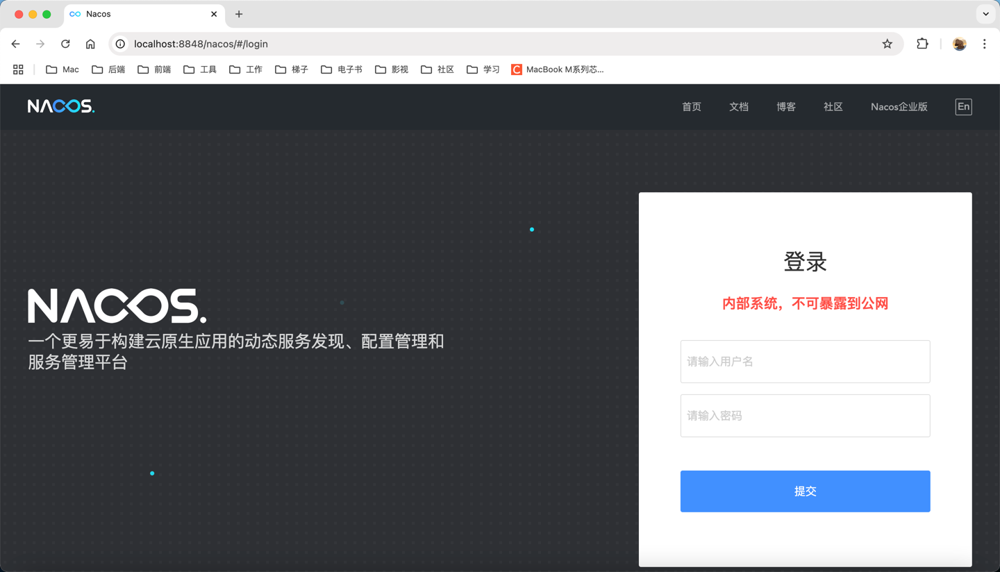

### 安装Docker
#### Docker-Desktop

```md
## 官方地址：
https://docs.docker.com/
```

### Docker环境
#### Elasticsearch

拉取elasticsearch镜像

```shell
docker pull elasticsearch:7.17.25
```

运行elasticsearch容器，并挂载Elasticsearch配置文件、数据文件、插件文件。

`注意：挂载的目录需要读写权限，命令如下：`
```shell
chmod -R 777 文件地址/目录地址
```

`运行elasticsearch容器并挂载文件路径，命令如下：`
```shell
docker run --name Elasticsearch-8.12.2 -p 9200:9200 -p 9300:9300 \
-e "discovery.type=single-node" \
-e ES_JAVA_OPTS="-Xms64m -Xmx512m" \
-e "ELASTIC_PASSWORD=your_password_here" \
-v /Library/MyFolder/Environment/Docker/Elasticsearch/config/elasticsearch.yml:/usr/share/elasticsearch/config/elasticsearch.yml \
-v /Library/MyFolder/Environment/Docker/Elasticsearch/data:/usr/share/elasticsearch/data \
-v /Library/MyFolder/Environment/Docker/Elasticsearch/plugins:/usr/share/elasticsearch/plugins \
-d elasticsearch:8.12.2
```

`elasticsearch.yml配置文件`

```yaml
# elasticsearch.yml配置文件
network.host: 0.0.0.0
http.port: 9200
# 取消安全认证
xpack.security.enabled: false
```

#### Kibana

拉取Kibana镜像，命令如下：

```shell
docker pull kibana:7.17.25
```

查询elasticsearch中的内部IP，命令如下：

```shell
docker inspect -f '{{range.NetworkSettings.Networks}}{{.IPAddress}}{{end}}' Elasticsearch-7.17.25
```

启动Kibana，命令如下：

```shell
docker run --name kibana -e ELASTICSEARCH_HOSTS=http://172.17.0.2:9200 -p 5601:5601 -d kibana:7.17.25
```

中文友好地分词插件，遵循官方文档即可自定义词库，[官方地址](https://github.com/infinilabs/analysis-ik/)，官方推荐下载地址：

`注意，下载分词器版本要与es、kibana版本一致`

```markdown
https://release.infinilabs.com/analysis-ik/stable
```

安装Ik分词器插件

1、将下载好的ik分词器压缩包上传至es容器中：

方式一：把ik分词器压缩包上传指挂载目录plugins中，进入es器，将ik分词器压缩包移出plugins目录至其他文件夹中，执行安装插件命令

方式二：通过`docker cp`命令，将ik分词器插件copy到es容器中，进入es容器，执行安装插件命令。

进入es容器命令：
```shell
docker exec -it ES容器ID或容器名称 /bin/bash
```

进入ES安装目录后，安装命令如下：
```shell
bin/elasticsearch-plugin install file:分词器压缩包路径
```

#### Oracle-19c版本

拉取Oracle镜像，命令如下：

镜像系统架构：``linux/amd64`` ``linux/arm64/v8``

```shell
docker pull kangaroo1122-docker.pkg.coding.net/project/public/oracle:19c-ee
```

运行容器，命令如下：

``注意：挂载目录时，需要该目录的读写权限``
```shell
# /vm-data/oracle-19c/oradata 为宿主机目录地址
docker run -d \
-p 1521:1521 \
-p 5500:5500 \
-e ORACLE_PDB=ORCL \
-e ORACLE_PWD=123456 \
-e ORACLE_CHARACTERSET=AL32UTF8 \
-e INIT_SGA_SIZE=3000 \
-e INIT_PGA_SIZE=1000 \
-v /vm-data/oracle-19c/oradata:/opt/oracle/oradata \
--name oracle19c \
oracle/database:19.19.0-ee
```

oracle创建用户
```sql
CREATE USER username IDENTIFIED BY password;
```

> 授权

相关Sql
```sql
GRANT CONNECT, RESOURCE, DBA TO username;
```

权限描述<br/>
`DBA`: 拥有全部特权，是系统最高权限，只有DBA才可以创建数据库结构。<br/>
`RESOURCE`: 拥有Resource权限的用户只可以创建实体，不可以创建数据库结构。<br/>
`CONNECT`: 拥有Connect权限的用户只可以登录Oracle，不可以创建实体，不可以创建数据库结构。<br/>

> 创建DB-Link

授权
```sql
grant CREATE PUBLIC DATABASE LINK,DROP PUBLIC DATABASE LINK to 用户视图; 
```

创建DB-Link
```sql
-- @开头的内容需要手动修改
-- @LinkName 链接名称;@Username 用户名;@Password 密码
-- @Host 主机地址;@Port 端口号;@ServerName 服务名
create public database link @LinkName
connect to @Username identified by @Password
using '(DESCRIPTION =(ADDRESS_LIST =(ADDRESS =(PROTOCOL = TCP)(HOST = @Host)(PORT = @Port)))(CONNECT_DATA =(SERVICE_NAME = @ServerName)))';
```

查询是否创建成功
```sql
-- Sql1:
select * from dba_db_links;
-- Sql2:
select owner,object_name from dba_objects where object_type='DATABASE LINK';--查询时间久
```
 
查询sql
```sql
-- @LinkName：创建的db-link名称
-- table：db-link链接的数据库表名
select * from table@LinkName
```

删除DB-Link
```sql
-- @LinkName：创建的db-link名称
drop public database link @LinkName
```

#### Nacos

> [!Warning]
> 获取镜像前请确认`SpringBoot`或者`SpringCloud`版本，请查看 [版本关系](backend/springcloud.md)</br>
> 此案例为 MacOS M1 芯片电脑环境，使用的版本为 v2.2.0-slim，对应的 SpringBoot版本为2.7.18

拉取 Nacos 镜像，命令如下：
```shell
docker pull nacos/nacos-server:v2.2.0-slim
```

启动 Nacos，命令如下：
```shell
docker run --name Nacos-2.2.0 \
    -e MODE=standalone \
    -p 8848:8848 \
    -p 9848:9848 \
    -p 9849:9849 \
    -d nacos/nacos-server:v2.2.0-slim
```

参数描述：
- `-e MODE=standalone`：单机模式启动
- `-p 8848:8848`：主端口 (HTTP): 默认为8848，此端口用于客户端、控制台及OpenAPI的HTTP通信。
- `-p 9848:9848`：客户端gRPC端口: 默认为主端口+1000，即9848，用于客户端通过gRPC协议向服务端发起连接和请求。
- `-p 9849:9849`：服务端gRPC端口: 默认为主端口+1001，即9849，用于服务间同步等内部通信。

> [!Warning]
> 对于暴露的端口描述，也可查看官方解释：https://nacos.io/en/blog/faq/nacos-user-question-history15220/

成功示例图：


### DockerCompose安装服务

#### mysql、redis、otel、minio、milvus
::: details 点我查看`docker-compose.yml`信息
```shell
version: '3.5'

services:
  etcd:
    container_name: milvus-etcd
    image: quay.io/coreos/etcd:v3.5.18
    environment:
      - ETCD_AUTO_COMPACTION_MODE=revision
      - ETCD_AUTO_COMPACTION_RETENTION=1000
      - ETCD_QUOTA_BACKEND_BYTES=4294967296
      - ETCD_SNAPSHOT_COUNT=50000
    volumes:
      - ${Home}/Docker/milvus/volumes/etcd:/etcd
    command: etcd -advertise-client-urls=http://etcd:2379 -listen-client-urls http://0.0.0.0:2379 --data-dir /etcd
    healthcheck:
      test: ["CMD", "etcdctl", "endpoint", "health"]
      interval: 30s
      timeout: 20s
      retries: 3
    networks:
      - docker-net

  minio:
    container_name: milvus-minio
    image: minio/minio:RELEASE.2024-05-28T17-19-04Z
    environment:
      MINIO_ACCESS_KEY: minioadmin
      MINIO_SECRET_KEY: minioadmin
    ports:
      - "9001:9001"
      - "9000:9000"
    volumes:
      - ${Home}/Docker/milvus/volumes/minio:/minio_data
    command: minio server /minio_data --console-address ":9001"
    healthcheck:
      test: ["CMD", "curl", "-f", "http://localhost:9000/minio/health/live"]
      interval: 30s
      timeout: 20s
      retries: 3
    networks:
      - docker-net

  standalone:
    container_name: milvus-standalone
    image: milvusdb/milvus:v2.5.14
    command: ["milvus", "run", "standalone"]
    security_opt:
      - seccomp:unconfined
    environment:
      MINIO_REGION: us-east-1
      ETCD_ENDPOINTS: etcd:2379
      MINIO_ADDRESS: minio:9000
      MILVUS_ENABLE_AUTH: true
      MILVUS_USER: admin
      MILVUS_PASSWORD: admin123
    volumes:
      - ${Home}/Docker/milvus/volumes/milvus:/var/lib/milvus
      - ${Home}/Docker/milvus/configs/milvus.yaml:/milvus/configs/milvus.yaml
    healthcheck:
      test: ["CMD", "curl", "-f", "http://localhost:9091/healthz"]
      interval: 30s
      start_period: 90s
      timeout: 20s
      retries: 3
    ports:
      - "19530:19530"
      - "9091:9091"
    depends_on:
      - "etcd"
      - "minio"
    networks:
      - docker-net
  
  mysql:
    image: mysql:8.0.42
    container_name: mysql8
    restart: "no"
    ports:
      - "3306:3306"
    networks:
      - docker-net
    environment:
      MYSQL_ROOT_PASSWORD: 84wl5rce
    volumes:
      - ${HOME}/Docker/mysql/my.cnf:/etc/mysql/my.cnf
      - mysql-data:/var/lib/mysql
    command: --default-authentication-plugin=mysql_native_password

  otel:
    image: otel/opentelemetry-collector-contrib:latest
    container_name: otel
    ports:
      - "4317:4317"
    volumes:
      - ${HOME}/Docker/otel/otel-config.yml:/etc/otelcol-contrib/config.yaml
    networks:
      - docker-net

  redis:
    image: redis:8.0
    container_name: redis8
    restart: always
    ports:
      - "6379:6379"
    networks:
      - docker-net
    volumes:
      - ${HOME}/Docker/redis/data:/data
      - ${HOME}/Docker/redis/conf/redis.conf:/usr/local/etc/redis/redis.conf
    command: redis-server /usr/local/etc/redis/redis.conf

volumes:
  mysql-data:

networks:
  default:
    name: docker-net
  docker-net:
    external: true
```
:::

> `milvus`相关

<Linkcard url="https://github.com/milvus-io/milvus" 
          title="官方仓库" 
          description="https://github.com/milvus-io/milvus"
/>

**`milvus` 相关的 `docker-compose.yml`、`milvus.yaml`文件信息请参考官方仓库，本文使用的版本为`v2.5.14`**
