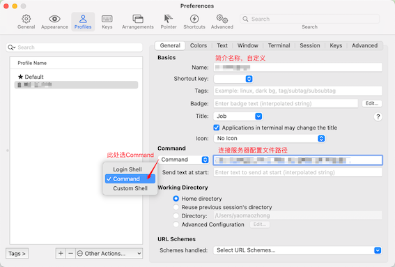

# Mac应用分享

### SublimeText

**配置终端快速打开文件夹、文件**

```shell
# 建立软连接
sudo ln -s "/Applications/Sublime Text.app/Contents/SharedSupport/bin/subl" /usr/local/bin/subl

# 检查是否成功
subl --version

# 在终端中以 SublimeText 快速打开文件
subl <文件夹/文件>
```

### Visual Studio Code

**配置终端快速打开文件夹、文件**

```shell
# 建立软连接
ln -s "/Applications/Visual Studio Code.app/Contents/Resources/app/bin/code" /usr/local/bin/code

# 检查是否成功
code --version

# 在终端中以 VsCode 快速打开文件
code <文件夹/文件>
```

### iTerm2 

#### oh-my-zsh 配置

<Linkcard url="https://ohmyz.sh/" title="官方地址" description="https://ohmyz.sh/"/>


#### 使用iTerm2连接远端服务器

查看并复制配置文件，放置指定目录：
```shell
#!/usr/bin/expect

set PORT 22
set HOST [你连接的主机名]
set USER root
set PASSWORD [密码]

spawn ssh -p $PORT $USER@$HOST
expect {
    "yes/no" {send "yes\r";exp_continue;}
    "*password:*" { send "$PASSWORD\r" }
    }
interact
```

**详细配置如图**
<p>

</p>
